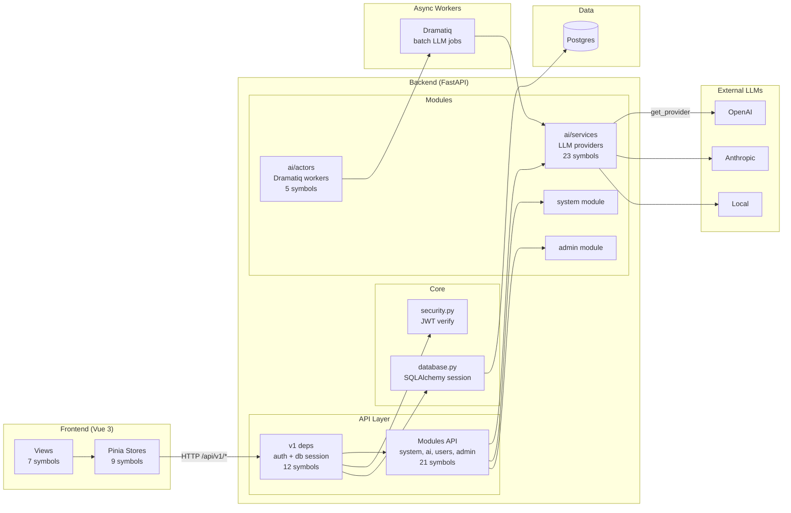

# Architecture

## Overview

FastAPI backend + Vue 3 frontend demo. 329 files, 2,851 symbols, 37 traced execution flows. Backend is modular (`backend/app/modules/<feature>` per domain), exposes versioned REST API under `api/v1`, persists to Postgres via SQLAlchemy, ships async work to Dramatiq workers, and proxies LLM calls to swappable providers (OpenAI, Anthropic, local).

## Functional Areas

GitNexus clusters (top 9, all symbols > cohesion threshold):

| Area | Symbols | Cohesion | Role |
|---|---|---|---|
| Tests | 45 | 77% | pytest suite across modules |
| Services | 23 | 87% | LLM provider registry + chat/stream/generate (`ai/services/llm_service.py`) |
| Api | 21 | 90% | Versioned FastAPI routers under `modules/*/api/` |
| V1 | 12 | 96% | v1 dependency wiring (`api/v1/deps.py`) — auth, db session, admin guard |
| Stores | 9 | 100% | Pinia stores on frontend |
| Views | 7 | 100% | Vue page components |
| Actors | 5 | 73% | Dramatiq background workers (`ai/actors/dramatiq_actors.py`) |
| Cluster_15 | 5 | 100% | Small focused cluster |
| __init__ | 5 | 100% | Module surface |

## Key Execution Flows

Top 5 processes by reach:

### 1. `Chat_completion → Get_provider` (5 steps, intra-community)

LLM streaming path. Client hits `/ai/chat`, handler picks provider, streams tokens back.

```
chat_completion          backend/app/modules/ai/api/chat.py
  → generate             backend/app/modules/ai/api/chat.py
    → stream_chat        backend/app/modules/ai/services/llm_service.py
      → generate_stream  backend/app/modules/ai/services/llm_service.py
        → get_provider   backend/app/modules/ai/services/llm_service.py
```

### 2. `Get_config → Get_db` (4 steps, cross-community)

Protected admin read. Auth chain resolves user → opens DB session.

```
get_config         modules/system/api/config.py
  → get_admin_user  api/v1/deps.py
    → get_current_user api/v1/deps.py
      → get_db       modules/core/database.py
```

### 3. `Get_config → Extract_token_from_request` (4 steps)

Same auth chain, terminal = JWT extraction.

```
get_config → get_admin_user → get_current_user → extract_token_from_request
```

### 4. `Get_config → Verify_token` (4 steps)

Same chain, terminal = JWT signature/expiry check in core security.

```
get_config → get_admin_user → get_current_user → verify_token (modules/core/security.py)
```

### 5. `Chat_completion → Get_db` (3 steps, cross-community)

LLM endpoint also requires auth + DB. Same deps chain, shorter (no admin guard).

```
chat_completion → get_current_user → get_db
```

Pattern: every protected endpoint runs the same `get_current_user → get_db` dep chain. Admin endpoints prepend `get_admin_user`. The chain is shared by ~20 processes (config, tracing logs, admin info, users, chat, etc.).

## Architecture Diagram



## Module Boundaries

- `backend/app/modules/<feature>/` — each domain owns `api/`, `services/`, `actors/`, `models/`, `tests/`
- `backend/app/api/v1/` — versioned dependency injection + router mounting
- `backend/app/modules/core/` — shared `database.py`, `security.py`, `config.py`
- Frontend: `frontend/src/views/`, `frontend/src/stores/`, aligned with backend feature modules
