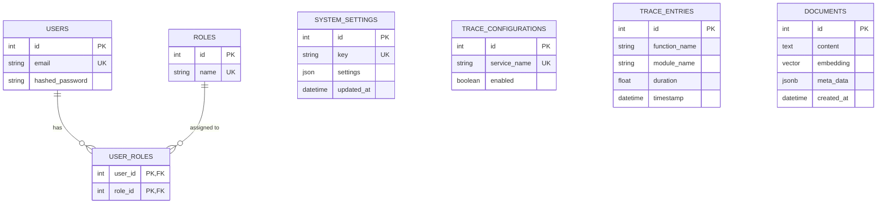

# Entity Relationship Diagram (ER Diagram)

This document visualizes the database schema for the backend application, including the core domain tables and the RAG integration (PGVector) table.

## Mermaid ER Diagram

## Schema Details & Domain Modeling

### 1. User & Access Control (RBAC)
*   `users`: Stores user identity credentials.
*   `roles`: System access levels (e.g., admin, user).
*   `user_roles`: Many-to-many relationship mapping table to support Role-Based Access Control.

### 2. System Settings
*   `system_settings`: Key-value storage for application runtime configurations (stored as unstructured JSON). Supports real-time toggling of features without service restarts.

### 3. Observability & Tracing (Internal Audit/Telemetry)
*   `trace_configurations`: Toggles active trace capturing per service module. (Deprecated: transition settings to `system_settings` key `"tracing.{service_name}"`).
*   `trace_entries`: Logged invocation durations and timestamps for system operations to identify performance hotspots.

### 4. Vector Database / RAG (PGVector Integration)
*   `documents`: Stores chunked text documentation and their 384-dimension vector embeddings generated by the embedding model (`all-MiniLM-L6-v2`). Also holds unstructured metadata for domain/category filtering during retrieval.
